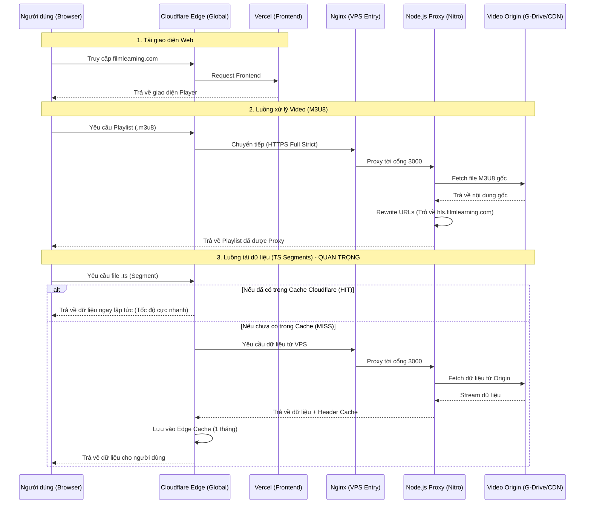

# Hướng dẫn triển khai HLS Proxy (Full HTTPS & Cloudflare)

Tài liệu này hướng dẫn chi tiết cách cài đặt hệ thống Proxy video lên VPS, cấu hình SSL trực tiếp và tối ưu hóa bằng Cloudflare.

---

## 1. Sơ đồ hệ thống chuyên nghiệp (High-Level Architecture)

Hệ thống của bạn được thiết kế theo mô hình **Multi-layered Proxy & Caching** để tối ưu hóa tốc độ và bảo mật.


### Luồng dữ liệu chi tiết (Complete Flow):



### Các thành phần tối ưu:
1.  **Cloudflare Edge:** Đóng vai trò là "lá chắn" và bộ nhớ đệm toàn cầu. Giúp giảm tải 95% cho VPS.
2.  **Nginx (SSL Termination):** Xử lý bảo mật HTTPS và lọc các request xấu (CORS, Rate Limit) trước khi đưa vào App.
3.  **Node.js (Nitro):** Xử lý logic thông minh: thay đổi header, parse m3u8, và stream dữ liệu trực tiếp (Streaming) để giảm độ trễ.
4.  **Full Strict SSL:** Đảm bảo dữ liệu được mã hóa từ trình duyệt đến tận VPS, tránh bị nhà mạng can thiệp.

---

## 2. Các bước triển khai chính

### Bước 1: Chuẩn bị trên VPS
1. **Cài đặt môi trường:** Node.js 20+, pnpm, PM2.
2. **Tải mã nguồn:** Clone project và cài đặt thư viện.
3. **Cấu hình:** Tạo file `.env` với `PORT=3000` và `ENABLE_CACHE=true`.
4. **Chạy ứng dụng:**
   ```bash
   pnpm build:node
   pm2 start .output/server/index.mjs --name "hls-proxy"
   ```

### Bước 2: Cấu hình Nginx & SSL
Đây là bước quan trọng để bảo mật và chạy được chế độ **Full (Strict)** trên Cloudflare.
*   [Xem chi tiết: Hướng dẫn thiết lập Nginx](./02_NGINX_SETUP_GUIDE.md)
*   [Xem chi tiết: Hướng dẫn cài đặt SSL Certbot](./03_SSL_SETUP_GUIDE.md)

### Bước 3: Tối ưu hóa Cloudflare
Cấu hình Cache Rules để Cloudflare gánh 95% băng thông thay cho VPS.
*   [Xem chi tiết: Hướng dẫn Caching Cloudflare](./04_CLOUDFLARE_CACHE_GUIDE.md)

---

## 3. Cách sử dụng URL cuối cùng

Sau khi hoàn tất, URL của bạn sẽ có dạng:

**Link Playlist:**
`https://hls.filmlearning.com/m3u8-proxy?url=[LINK_M3U8_GOC]&headers=[JSON_HEADERS]`

**Link Segment (Tự động sinh ra):**
`https://hls.filmlearning.com/ts-proxy?url=[LINK_TS_GOC]`

---
*Người viết: Antigravity AI Assistant*